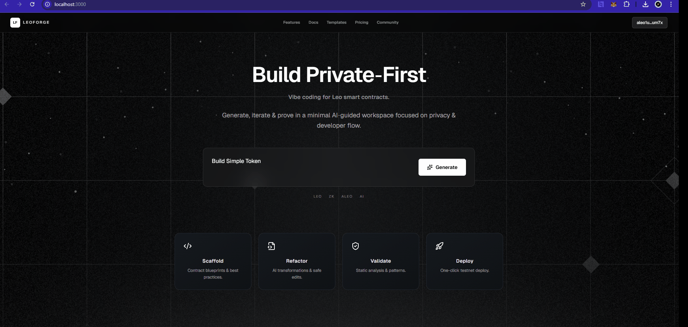

# LeoForgeEngine

## Generating Valid Leo Code? Impossible?

Not anymore. Welcome to **LeoForgeEngine** - the most advanced autonomous Leo code generation system ever built.

While generating syntactically correct code for traditional languages is challenging, generating **valid, compilable Leo code** represents the pinnacle of complexity in blockchain development. Leo's strict compilation requirements, unique privacy model, and specialized syntax make it the ultimate test for AI-driven code generation. We've conquered this challenge by building our own mini-framework at the lowest possible API layer.

## What Makes This Impossible Challenge Possible

### The Leo Generation Problem

Leo isn't just another programming language. It's a domain-specific language with:
- **Strict compilation rules** that reject 90% of syntactically "correct" code
- **Advanced semantics** requiring deep understanding of records vs mappings
- **Async/finalize patterns** that must be perfectly orchestrated
- **Address validation** with 63-character cryptographic constraints
- **Zero-knowledge proof compilation** that demands mathematical precision

### Our Solution: LeoForgeEngine

We've built the world's first **autonomous Leo code generation and auto-correction system** that:

1. **Generates Production-Ready Leo Code**: Not just syntax, but semantically correct, compilable Leo programs
2. **Self-Corrects Compilation Errors**: Advanced error detection and automatic fixing using tool-enhanced AI agents
3. **Validates Cryptographic Constraints**: Automatic address validation and replacement
4. **Streams Real-Time Generation**: Live code streaming with immediate feedback
5. **Handles Complex DeFi Logic**: From simple tokens to sophisticated DEX protocols

## Architecture Deep Dive

### Core Components

#### 1. LeoCodeEngine (`src/main/java/com/reglisseforge/tools/LeoCodeEngine.java`)
The heart of the system. Orchestrates the entire generation pipeline:
- Project initialization with Leo CLI integration
- Streaming code generation with Claude 3.7 Sonnet
- Extended thinking tokens for complex reasoning
- Real-time output to console and file system
- Automatic address validation and correction

#### 2. LeoCodeCorrector (`src/main/java/com/reglisseforge/tools/LeoCodeCorrector.java`)
Autonomous error fixing agent with tool capabilities:
- Compilation error detection and analysis
- Multi-attempt correction loops (up to 20 iterations)
- File reading/editing tools for precise fixes
- Integration with Leo compiler for validation

#### 3. Tool Framework (`src/main/java/com/reglisseforge/tools/base/`)
Custom-built tool system for AI agents:
- **ToolRegistry**: Dynamic tool discovery and schema generation
- **ToolExecutor**: Safe tool execution with type conversion
- **Tool Annotations**: Declarative tool definition system

#### 4. Leo Language System (`src/main/java/com/reglisseforge/utils/LeoPrompt.java`)
Comprehensive Leo language knowledge base:
- Complete Leo v2.0+ syntax reference
- Deprecation warnings (finalize → async)
- Best practices and common patterns
- Valid address constants and validation

### Generated Examples

The `exemple/` directory showcases the system's capabilities:

- **DeFi Lending Protocol** (`exemple/v0.1/defi_lending/`)
- **Marketplace System** (`exemple/v0.1/simple_marketplace/`)
- **Sustainability Verification** (`exemple/v0.1/sustainability_verify/`)
- **Zero-Knowledge Inheritance** (`exemple/v0.1/ziterance/`)
- **Mobile ZK Payments** (`exemple/v0.1/zkpay_mobile/`)
- **Advanced DEX Protocol** (`exemple/v0.2/simple_dex/`)

Each example demonstrates increasing complexity and real-world applicability.

## Setup and Installation

### Prerequisites

- **Java 21+** (Required for advanced language features)
- **Leo CLI** (Latest version from Aleo)
- **Maven 3.8+**
- **Anthropic API Key** (Claude access)

### Installation Steps

1. **Clone the Repository**
   ```bash
   git clone https://github.com/your-org/LeoForgeEngine.git
   cd LeoForgeEngine
   ```

2. **Install Leo CLI**
   ```bash
   curl -L https://github.com/AleoNet/leo/releases/latest/download/leo-x86_64-unknown-linux-gnu.tar.gz | tar -xz
   sudo mv leo /usr/local/bin/
   ```

3. **Set Environment Variables**
   ```bash
   export ANTHROPIC_API_KEY="your_api_key_here"
   ```

4. **Build the Project**
   ```bash
   mvn clean compile
   ```

5. **Run LeoForgeEngine**
   ```bash
   mvn exec:java -Dexec.mainClass="com.reglisseforge.Main"
   ```

### Configuration

Edit `src/main/java/com/reglisseforge/Main.java` to customize:
- Project name and description
- Generation parameters
- Output directories

```java
public static void main(String[] args) {
    LeoCodeEngine engine = new LeoCodeEngine();
    
    // Initialize your project
    engine.initProject("your_project_name", "Your project description");
    
    // Build and automatically fix any issues
    engine.buildAndFix();
}
```

## The Technology Stack

### Dependencies
- **Anthropic Java SDK 2.5.1**: Direct Claude API integration
- **Jackson 2.18.2**: JSON processing and tool parameter handling
- **Apache Commons Exec 1.5.0**: Safe command execution
- **Log4j2 2.24.1**: Comprehensive logging system
- **Lombok 1.18.38**: Code generation and boilerplate reduction

### Key Features
- **Streaming Generation**: Real-time code output with chunked processing
- **Extended Thinking**: 10,000 token thinking budget for complex reasoning
- **Tool-Enhanced Corrections**: AI agents with file system access
- **Automatic Validation**: Address checking and replacement
- **Multi-Attempt Fixing**: Iterative error correction up to 20 attempts

## Roadmap

**Note:** LeoForgeEngine is currently in its early development stages. This is a foundational implementation with significant improvements and optimizations planned for future releases.

### Phase 1: Cost & Performance Optimization
- **Reduce Token Costs**: Implement caching for Leo language rules and common patterns
- **Faster Generation**: Optimize streaming pipeline and reduce thinking token usage
- **Smart Retries**: Context-aware error correction with fewer iterations

### Phase 2: Hot vs Cold Generation
- **Cold Generation**: Full project generation from scratch (current)
- **Hot Generation**: Incremental updates and modifications to existing code
- **Local Agent Testing**: Autonomous testing and validation before human review
- **Issue-Specific Fixing**: Targeted corrections for specific compilation errors

### Phase 3: LeoForgeVision
- **Visual Frontend**: Web-based interface for project management
- **Real-Time Collaboration**: Multiple developers working on Leo projects
- **Template Gallery**: Pre-built patterns for common DeFi protocols
- **Deployment Pipeline**: Integrated testnet deployment and validation

### Phase 4: Enterprise & Scaling
- **Team Collaboration**: Multi-user workspaces and project sharing
- **CI/CD Integration**: GitHub Actions and automated testing pipelines
- **Advanced Analytics**: Code quality metrics and optimization suggestions
- **Enterprise Security**: On-premise deployment and audit logging

## Built for Aleo CodeSprint v4.0

LeoForgeEngine was specifically developed for **Aleo CodeSprint v4.0**, pushing the boundaries of what's possible in automated blockchain development. This isn't just a code generator—it's a complete development companion that understands the intricacies of zero-knowledge programming.

## Contributing

This project represents months of research into AI-assisted blockchain development. The core framework is designed to be extensible and can be adapted for other domain-specific languages beyond Leo.

### Development Guidelines
- Follow Java 21 best practices
- Maintain comprehensive logging
- Add tool annotations for new capabilities
- Update Leo language rules as the ecosystem evolves

## License

**Creative Commons Attribution-NonCommercial 4.0 International (CC BY-NC 4.0)**

This project is licensed under CC BY-NC 4.0, which means:

**You are free to:**
- **Share** — copy and redistribute the material in any medium or format
- **Adapt** — remix, transform, and build upon the material

**Under the following terms:**
- **Attribution** — You must give appropriate credit, provide a link to the license, and indicate if changes were made
- **NonCommercial** — You may not use the material for commercial purposes without explicit written permission from the author

**Commercial Use:** For commercial licensing, partnerships, or enterprise deployments, please contact Sagliss Oussama for permission and licensing terms.

Built with passion for the Aleo ecosystem and the future of zero-knowledge applications.

## The Vision: LeoForge Platform

The ultimate goal is to develop **LeoForge** - a comprehensive Leo development platform where **LeoGen serves as the core generation engine**. LeoForgeEngine is the foundational technology that will power the complete LeoForge ecosystem.

### What LeoForge Will Become

LeoForge envisions a future where Leo development is:
- **Visual and Intuitive**: Web-based interface for building zero-knowledge applications
- **AI-Assisted**: LeoGen engine providing intelligent code generation and suggestions  
- **Collaborative**: Team workspaces and real-time development collaboration
- **Production-Ready**: Integrated testing, deployment, and monitoring tools



*LeoForge Platform - The future of Leo development is visual, intelligent, and collaborative.*

---

**The future of Leo development is autonomous. Welcome to LeoForgeEngine.**